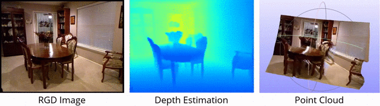

# Monocular-Depth-Estimation-Toolbox
## Introduction

Monocular-Depth-Estimation-Toolbox is an open source monocular depth estimation toolbox based on PyTorch and [MMSegmentation](https://github.com/open-mmlab/mmsegmentation) v0.16.0.

It aims to benchmark MonoDepth methods and provides effective supports for evaluating and visualizing results.

<div align=center></div>


### Major features
- **Unified benchmark**
  
  Provide a unified benchmark toolbox for various depth estimation methods.
- **Modular design**
  
  Depth estimation frameworks are decomposed into different components. One can easily construct a customized framework by combining different modules.
- **Support of multiple methods out of box**
  
  I would like to reproduce some of the most excellent depth estimation methods based on this toolbox.
- **High efficiency**
  
  It seems that there are few depth estimation benchmarks, so I start this project and hope it is helpful for research.

Thanks to MMSeg, we own these major features. :blush:

## Benchmark and model zoo

Results and models are available in the [model zoo (TODO)](docs/model_zoo.md).

Supported backbones (partially release):
- [x] ResNet (CVPR'2016)
- [x] EfficientNet (ICML'2019)
- [x] Vision Transformer (ICLR'2021)
- [x] Swin Transformer (ICCV'2021)
- I recommend cross-package import in config, so that you can utilize other backbone in MMcls, MMseg, *etc*. Refer to [introduction](https://zhuanlan.zhihu.com/p/436865195). I will add more backbones in the future.

Supported methods:
- [x] [BTS (Arxiv'2019)](configs/bts)
- [x] [Adabins (CVPR'2021)](configs/adabins)
- [x] [SimIPU (AAAI'2022)](configs/simipu)
- [x] [DPT (ICCV'2021) (TBD)](configs/dpt)
- [x] [DepthFormer (Arxiv'2022)](configs/depthformer)

Supported datasets:
- [x] [KITTI](docs/dataset_prepare.md#KITTI)
- [x] [NYU-Depth-V2](docs/dataset_prepare.md#NYU)
- [x] [SUN RGB-D (Eval)](docs/dataset_prepare.md#SUNRGBD)
- [x] [Cityscapes](docs/dataset_prepare.md#Cityscapes)


## Installation

Please refer to [get_started.md](docs/get_started.md#installation) for installation and [dataset_prepare.md](docs/dataset_prepare.md#prepare-datasets) for dataset preparation.

## Get Started

We provide [train.md](docs/train.md) and [inference.md](docs/inference.md) for the usage of this toolbox. 

<!-- In the future, there will be tutorials for [customizing dataset (TODO)](docs/tutorials/customize_datasets.md), [designing data pipeline (TODO)](docs/tutorials/data_pipeline.md), [customizing modules (TODO)](docs/tutorials/customize_models.md), and [customizing runtime (TODO)](docs/tutorials/customize_runtime.md). We also provide [training tricks (TODO)](docs/tutorials/training_tricks.md). -->

## License

This project is released under the [Apache 2.0 license](LICENSE).

## Acknowledgement

This repo benefits from awesome works of [mmsegmentation](https://github.com/open-mmlab/mmsegmentation), [Adabins](https://github.com/shariqfarooq123/AdaBins),
[BTS](https://github.com/cleinc/bts). Please also consider citing them.


## TODO

- Some annotations in codes are futile, waiting to be rewritten.
- I will release codes of BinsFormer soon.
- I would like to include self-supervised depth estimation methods, such as MonoDepth2.

## Cite

```bibtex
@article{li2021simipu,
  title={SimIPU: Simple 2D Image and 3D Point Cloud Unsupervised Pre-Training for Spatial-Aware Visual Representations},
  author={Li, Zhenyu and Chen, Zehui and Li, Ang and Fang, Liangji and Jiang, Qinhong and Liu, Xianming and Jiang, Junjun and Zhou, Bolei and Zhao, Hang},
  journal={arXiv preprint arXiv:2112.04680},
  year={2021}
}
```
