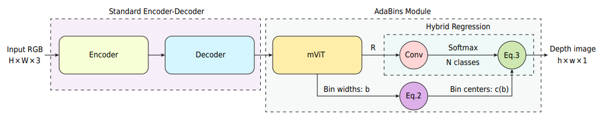

# Adabins

[Adabins: Depth estimation using adaptive bins](https://arxiv.org/abs/2011.14141)

## Introduction

<a href="https://github.com/shariqfarooq123/AdaBins">Official Repo</a>

## Abstract

We address the problem of estimating a high quality dense depth map from a single RGB input image. We start out with a baseline encoder-decoder convolutional neural network architecture and pose the question of how the global processing of information can help improve overall depth estimation. To this end, we propose a transformer-based architecture block that divides the depth range into bins whose center value is estimated adaptively per image. The final depth values are estimated as linear combinations of the bin centers. We call our new building block AdaBins. Our results show a decisive improvement over the state-of-the-art on several popular depth datasets across all metrics. We also validate the effectiveness of the proposed block with an ablation study and provide the code and corresponding pre-trained weights of the new state-of-the-art model.


## Framework
<div align=center></div>

## Citation

```bibtex
@inproceedings{bhat2021adabins,
  title={Adabins: Depth estimation using adaptive bins},
  author={Bhat, Shariq Farooq and Alhashim, Ibraheem and Wonka, Peter},
  booktitle={Proceedings of the IEEE/CVF Conference on Computer Vision and Pattern Recognition},
  pages={4009--4018},
  year={2021}
}
```

## Results and models

### KITTI

| Method | Backbone | Train Epoch | Abs Rel (+flip) | RMSE (+flip) | Config | Download |
| ------ | :--------: | :----: | :--------------: | :------: | :------: | :--------: |
| Official | EfficientNetB5-AP   |  25   | 0.058 | 2.36 |  - | -
| Adabins  |  EfficientNetB5-AP  |  24   | 0.058 | 2.33 |  [config](adabins_efnetb5ap_kitti_24e.py) | [log](resources/logs/adabins_efnetb5ap_kitti_24e.txt) \| [model](https://drive.google.com/file/d/17srI3mFoYLdnN1As4a2fRGrHA0UHuujX/view?usp=sharing)


### NYU

| Method | Backbone | Train Epoch | Abs Rel (+flip) | RMSE (+flip) | Config | Download |
| ------ | :--------: | :----: | :--------------: | :------: |  :------: | :--------: |
| Official | EfficientNetB5-AP   |  25   | 0.103 | 0.364 |  - | -
| Adabins  | EfficientNetB5-AP   |  24   | 0.106 | 0.368 |  [config](adabins_efnetb5ap_nyu_24e.py) | [log](resources/logs/adabins_efnetb5ap_nyu_24e.txt) \| [model](https://drive.google.com/file/d/1NRTWApIrxOjeeN7FdNTTOXV3KOuo_-aC/view?usp=sharing)
| Adabins  | ResNet-50   |  24   | 0.141 | 0.451 |  [config](adabins_r50_nyu_24e.py) | [log](resources/logs/adabins_r50_nyu_24e.txt) \| [model](https://drive.google.com/file/d/1cVvmJjot1rLk06FkAQl_PCeMOApt6-7x/view?usp=sharing)


