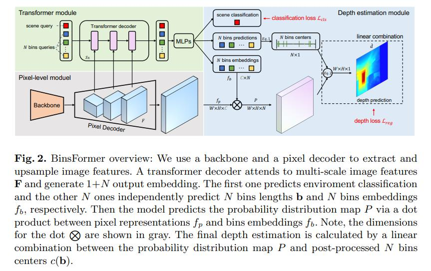

# Adabins

[BinsFormer: Revisiting Adaptive Bins for Monocular Depth Estimation](https://arxiv.org/abs/2204.00987)

## Introduction

This is the official implementation.

## Abstract

Monocular depth estimation is a fundamental task in computer vision and has drawn increasing attention. Recently, some methods reformulate it as a classification-regression task to boost the model performance, where continuous depth is estimated via a linear combination of predicted probability distributions and discrete bins. In this paper, we present a novel framework called BinsFormer, tailored for the classification-regression-based depth estimation. It mainly focuses on two crucial components in the specific task: 1) proper generation of adaptive bins and 2) sufficient interaction between probability distribution and bins predictions. To specify, we employ the Transformer decoder to generate bins, novelly viewing it as a direct set-to-set prediction problem. We further integrate a multi-scale decoder structure to achieve a comprehensive understanding of spatial geometry information and estimate depth maps in a coarse-to-fine manner. Moreover, an extra scene understanding query is proposed to improve the estimation accuracy, which turns out that models can implicitly learn useful information from an auxiliary environment classification task. Extensive experiments on the KITTI, NYU, and SUN RGB-D datasets demonstrate that BinsFormer surpasses state-of-the-art monocular depth estimation methods with prominent margins.


## Framework
<div align=center></div>

## Citation

```bibtex
@article{li2022binsformer,
  title={BinsFormer: Revisiting Adaptive Bins for Monocular Depth Estimation},
  author={Li, Zhenyu and Wang, Xuyang and Liu, Xianming and Jiang, Junjun},
  journal={arXiv preprint arXiv:2204.00987},
  year={2022}
}
```

## Results and models

### NYU

| Method | Backbone | Train Iters | Abs Rel (+flip) | RMSE (+flip) | Config | Download | GPUs |
| ------ | :--------: | :----: | :--------------: | :------: | :------: | :--------: | :---:|
| BinsFormer | SwinT-w7-1k   |  38400   | 0.113 | 0.379 |  [config](binsformer_swint_w7_nyu.py) | [log](resources/logs/binsformer_swint_w7_nyu.txt) \| [model](https://drive.google.com/file/d/1tcWx_BQBNJHpP5-RUWGWjpVRfeUiUMzJ/view?usp=sharing) | 8 V100s |
| BinsFormer  |  SwinL-w7-22k  |  38400   | 0.094 | 0.330 |  [config](binsformer_swinl_22k_w7_nyu.py) | [log](resources/logs/binsformer_swinl_22k_w7.txt) \| [model](https://drive.google.com/file/d/1j1FmtXKSOD5e6HWBBd_3cwI2M11Jd_nB/view?usp=sharing) | 8 V100s |

## Tips
- We experimentally observe that BinsFormer has the best performance trained by 8 GPUs with `samples_per_gpu=2`. I find that the KITTI-trained models seem to be lost. Since currently I only have 2 GPUs, it can be sort of hard to reproduce the results in our paper, but I will still make my best effort.

- I will provide results with ResNet backbone on NYU soon.