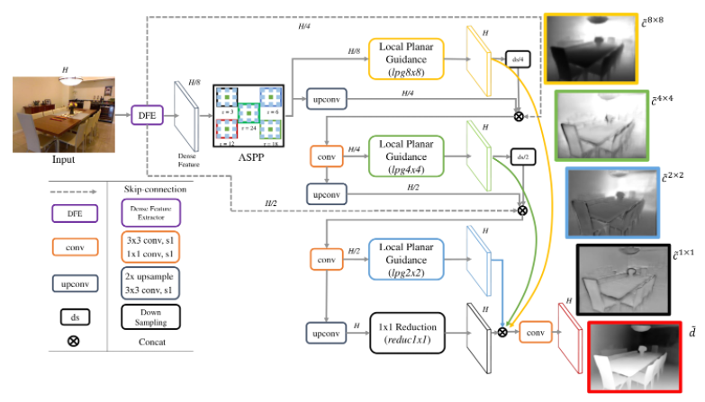

# Adabins

[From Big to Small: Multi-Scale Local Planar Guidance for Monocular Depth Estimation](https://arxiv.org/abs/1907.10326)

## Introduction

<a href="https://github.com/cleinc/bts">Official Repo</a>

## Abstract

Estimating accurate depth from a single image is challenging because it is an ill-posed problem as infinitely many 3D scenes can be projected to the same 2D scene. However, recent works based on deep convolutional neural networks show great progress with plausible results. The convolutional neural networks are generally composed of two parts: an encoder for dense feature extraction and a decoder for predicting the desired depth. In the encoder-decoder schemes, repeated strided convolution and spatial pooling layers lower the spatial resolution of transitional outputs, and several techniques such as skip connections or multi-layer deconvolutional networks are adopted to recover the original resolution for effective dense prediction. In this paper, for more effective guidance of densely encoded features to the desired depth prediction, we propose a network architecture that utilizes novel local planar guidance layers located at multiple stages in the decoding phase. We show that the proposed method outperforms the state-of-the-art works with significant margin evaluating on challenging benchmarks. We also provide results from an ablation study to validate the effectiveness of the proposed method.


## Framework
<div align=center></div>

## Citation

```bibtex
@article{lee2019big,
  title={From big to small: Multi-scale local planar guidance for monocular depth estimation},
  author={Lee, Jin Han and Han, Myung-Kyu and Ko, Dong Wook and Suh, Il Hong},
  journal={arXiv preprint arXiv:1907.10326},
  year={2019}
}
```

## Results and models

### KITTI

| Method | Backbone | Train Epoch | Abs Rel | RMSE | Config | Download |
| ------ | :--------: | :----: | :--------------: | :------: | :------: | :--------: |
| Official | ResNet-50 |  50   | 0.061 | 2.80 |  - | -
| BTS      | ResNet-50 |  24   | 0.059 | 2.50 |  [config](https://github.com/zhyever/Monocular-Depth-Estimation-Toolbox/blob/main/configs/bts/bts_r50_kitti_24e.py) | [log](https://github.com/zhyever/Monocular-Depth-Estimation-Toolbox/blob/main/configs/bts/resources/logs/bts_r50_kitti_24e.txt) \| [model](https://drive.google.com/file/d/1epjGHnEBbyxhauX0Ad43SSD71ldFMRpO/view?usp=sharing)


### NYU

| Method | Backbone | Train Epoch | Abs Rel | RMSE | Config | Download |
| ------ | :--------: | :----: | :--------------: | :------: |  :------: | :--------: |
| Official | ResNet-50 |  50   | 0.119 | 0.42 |  - | -
| BTS      | ResNet-50 |  24   | 0.114 | 0.41 |  [config](https://github.com/zhyever/Monocular-Depth-Estimation-Toolbox/blob/main/configs/bts/bts_r50_nyu_24e.py) | [log](https://github.com/zhyever/Monocular-Depth-Estimation-Toolbox/blob/main/configs/bts/resources/logs/bts_r50_nyu_24e.txt) \| [model](https://drive.google.com/file/d/1O8C57nq7Cydy4WGqNhR0Y3rxcUph7jcX/view?usp=sharing)

