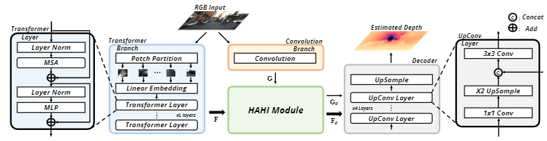

# DepthFormer

[DepthFormer: DepthFormer: Exploiting Long-Range Correlation and Local Information for Accurate Monocular Depth Estimation](https://arxiv.org/abs/2203.14211)

## Introduction

This is the official implementation.

## Abstract

This paper aims to address the problem of supervised monocular depth estimation. We start with a meticulous pilot study to demonstrate that the long-range correlation is essential for accurate depth estimation. Therefore, we propose to leverage the Transformer to model this global context with an effective attention mechanism. We also adopt an additional convolution branch to preserve the local information as the Transformer lacks the spatial inductive bias in modeling such contents. However, independent branches lead to a shortage of connections between features. To bridge this gap, we design a hierarchical aggregation and heterogeneous interaction module to enhance the Transformer features via element-wise interaction and model the affinity between the Transformer and the CNN features in a set-to-set translation manner. Due to the unbearable memory cost caused by global attention on high-resolution feature maps, we introduce the deformable scheme to reduce the complexity. Extensive experiments on the KITTI, NYU, and SUN RGB-D datasets demonstrate that our proposed model, termed DepthFormer, surpasses state-of-the-art monocular depth estimation methods with prominent margins. Notably, it achieves the most competitive result on the highly competitive KITTI depth estimation benchmark.

## Framework
<div align=center></div>

## Citation

```bibtex
@article{li2022depthformer,
  title={DepthFormer: DepthFormer: Exploiting Long-Range Correlation and Local Information for Accurate Monocular Depth Estimation},
  author={Li, Zhenyu and Chen, Zehui and Liu, Xianming and Jiang, Junjun},
  journal={arXiv preprint arXiv:2203.14211},
  year={2022}
}
```

## Results and models

*As discussed in Issue [#20](https://github.com/zhyever/Monocular-Depth-Estimation-Toolbox/issues/20), the loss may not converge as normal when directly regressing the depth value. Hence, we add a simple warmup strategy in the sigloss function. Hence, consider setting the `warm_up=True` for the sigloss as: `loss_decode=dict(type='SigLoss', valid_mask=True, loss_weight=1.0, warm_up=True)`, or setting the `scale_up=True` for the decode_head to predict depth in a sigmoid manner.*

*The results here are obtained following the default setting (i.e., direct regression).*


### KITTI

| Method | Backbone | Train Iters | Abs Rel (+flip) | RMSE (+flip) | Config | Download | GPUs |
| ------ | :--------: | :----: | :--------------: | :------: | :------: | :--------: | :---:|
| DepthFormer  |  SwinL-w7-22k  |  38400   | 0.052 | 2.133 |  [config](depthformer_swinl_22k_w7_kitti.py) | [log](resources/logs/depthformer_swinl_22k_w7_kitti.txt) \| [model](https://drive.google.com/file/d/1BpcY9tULBRTW-cG8EVHBAZBapAv3ide4/view?usp=sharing) | 8 V100s |

### NYU

| Method | Backbone | Train Iters | Abs Rel (+flip) | RMSE (+flip) | Config | Download | GPUs |
| ------ | :--------: | :----: | :--------------: | :------: | :------: | :--------: | :---:|
| DepthFormer | SwinT-w7-1k   |  38400   | 0.120 | 0.402 |  [config](depthformer_swint_w7_nyu.py) | [log](resources/logs/depthformer_swint_w7_nyu.txt) \| [model](https://drive.google.com/file/d/1u8Kjgd9EmwwB_xMeBD7XaalpDygbSP73/view?usp=sharing) | 2 3090s |
| DepthFormer  |  SwinL-w7-22k  |  38400   | 0.094 | 0.330 |  [config](depthformer_swinl_22k_w7_nyu.py) | [log](resources/logs/depthformer_swinl_22k_w7_nyu.txt) \| [model](https://drive.google.com/file/d/1GMEgiiE-bkHYYD2xL8W6Qz50qa_P4T6e/view?usp=sharing) | 8 V100s |

