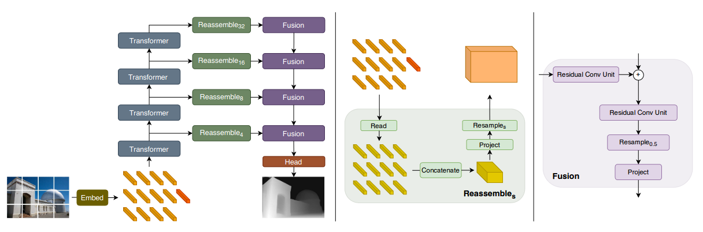

# DPT

[Vision Transformer for Dense Prediction](https://arxiv.org/abs/2103.13413)

## Introduction

<a href="https://github.com/isl-org/DPT">Official Repo</a>

## Abstract

We introduce dense vision transformers, an architecture that leverages vision transformers in place of convolutional networks as a backbone for dense prediction tasks. We assemble tokens from various stages of the vision transformer into image-like representations at various resolutions and progressively combine them into full-resolution predictions using a convolutional decoder. The transformer backbone processes representations at a constant and relatively high resolution and has a global receptive field at every stage. These properties allow the dense vision transformer to provide finer-grained and more globally coherent predictions when compared to fully-convolutional networks. Our experiments show that this architecture yields substantial improvements on dense prediction tasks, especially when a large amount of training data is available. For monocular depth estimation, we observe an improvement of up to 28% in relative performance when compared to a state-of-the-art fully-convolutional network. When applied to semantic segmentation, dense vision transformers set a new state of the art on ADE20K with 49.02% mIoU. We further show that the architecture can be fine-tuned on smaller datasets such as NYUv2, KITTI, and Pascal Context where it also sets the new state of the art. Our models are available at this <a href="https://github.com/isl-org/DPT">https URL</a>.


## Framework
<div align=center></div>

## Citation

```bibtex
@inproceedings{ranftl2021vision,
  title={Vision transformers for dense prediction},
  author={Ranftl, Ren{\'e} and Bochkovskiy, Alexey and Koltun, Vladlen},
  booktitle={Proceedings of the IEEE/CVF International Conference on Computer Vision},
  pages={12179--12188},
  year={2021}
}
```

## Usage

To use other repositories' pre-trained models, it is necessary to convert keys.

We provide a script [`vit2depth.py`](../../tools/model_converters/vit2depth.py) in the tools directory to convert the key of models from [timm](https://github.com/rwightman/pytorch-image-models/blob/master/timm/models/vision_transformer.py) to MMSegmentation style.

```shell
python tools/model_converters/vit2depth.py ${PRETRAIN_PATH} ${STORE_PATH}
```

E.g.

```shell
python tools/model_converters/vit2depth.py https://github.com/rwightman/pytorch-image-models/releases/download/v0.1-vitjx/jx_vit_base_p16_224-80ecf9dd.pth pretrain/jx_vit_base_p16_224-80ecf9dd.pth
```

This script convert model from `PRETRAIN_PATH` and store the converted model in `STORE_PATH`.

## Results and models

*This is a simple implementation. Only model structure can be aligned with original paper. More experiments about training settings or loss functions are needed to be done.*

*We have achieved better results compared with results presented in our paper DepthFormer by conducting more carefully designed tricks.*

In our reproduction, we utilize the standard ImageNet pre-trained ViT-Base instead of the ADE20K pre-trained model in the original paper, which is fairer to compare with other monodepth methods. We find it seems that with direct training on a small dataset (like KITTI and NYU), the model tends to be overfitting and cannot achieve satisfying results.

### KITTI

| Method | Backbone | Train Epoch | Abs Rel (+flip) | RMSE (+flip) | Config | Download | GPUs |
| ------ | :--------: | :----: | :--------------: | :------: | :------: | :--------: | :---:|
| DPT  |  ViT-Base  |  24   | 0.073 | 2.604 |  [config](dpt_vit-b16_kitti.py) | [log](resources/logs/dpt_vitb_kitti_24e.txt) \| [model](https://drive.google.com/file/d/1ZuFh7COIgPs4Aml3Rrld54A5eYmBHggP/view?usp=sharing) | 8 V100s |

### NYU

| Method | Backbone | Train Epoch | Abs Rel (+flip) | RMSE (+flip) | Config | Download | GPUs |
| ------ | :--------: | :----: | :--------------: | :------: | :------: | :--------: | :---:|
| DPT  |  ViT-Base  |  24   | 0.135 | 0.413 |  [config](dpt_vit-b16_nyu.py) | [log](resources/logs/dpt_vitb_nyu_24e.txt) \| [model](https://drive.google.com/file/d/13lxVNf-B5qt1cOoxSWTkVf3HlJGE-olv/view?usp=sharing) | 8 V100s |
