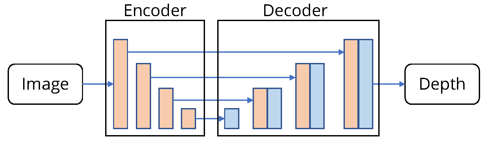

# SimIPU

[SimIPU: Simple 2D Image and 3D Point Cloud Unsupervised Pre-Training
for Spatial-Aware Visual Representations](https://arxiv.org/abs/2112.04680)

## Introduction

<a href="https://github.com/zhyever/SimIPU">Official Repo</a>

## Abstract

Pre-training has become a standard paradigm in many computer vision tasks. However, most of the methods are generally designed on the RGB image domain. Due to the discrepancy between the two-dimensional image plane and the three-dimensional space, such pre-trained models fail to perceive spatial information and serve as sub-optimal solutions for 3D-related tasks. To bridge this gap, we aim to learn a spatial-aware visual representation that can describe the three-dimensional space and is more suitable and effective for these tasks. To leverage point clouds, which are much more superior in providing spatial information compared to images, we propose a simple yet effective 2D Image and 3D Point cloud Unsupervised pre-training strategy, called SimIPU. Specifically, we develop a multi-modal contrastive learning framework that consists of an intra-modal spatial perception module to learn a spatial-aware representation from point clouds and an inter-modal feature interaction module to transfer the capability of perceiving spatial information from the point cloud encoder to the image encoder, respectively. Positive pairs for contrastive losses are established by the matching algorithm and the projection matrix. The whole framework is trained in an unsupervised end-to-end fashion. To the best of our knowledge, this is the first study to explore contrastive learning pre-training strategies for outdoor multi-modal datasets, containing paired camera images and LIDAR point clouds.

## Method
SimIPU is a multi-modal pre-training strategy utilizing contrastive learning. To evaluate the effectiveness of our proposed method, we design a simple depth estimation framework. The network architectures follow the generic monodepth design consisting of a ResNet-50 encoder and a [densedepth](https://arxiv.org/abs/1812.11941) decoder. The framework is trained by the SigLoss proposed in this [paper](https://arxiv.org/abs/1411.4734).

## Framework
<div align=center></div>

## Citation

```bibtex
@article{li2021simipu,
  title={SimIPU: Simple 2D Image and 3D Point Cloud Unsupervised Pre-Training for Spatial-Aware Visual Representations},
  author={Li, Zhenyu and Chen, Zehui and Li, Ang and Fang, Liangji and Jiang, Qinhong and Liu, Xianming and Jiang, Junjun and Zhou, Bolei and Zhao, Hang},
  journal={arXiv preprint arXiv:2112.04680},
  year={2021}
}
```

## Results and models

### KITTI

| Method | Backbone | Pre-train Num. | Pre-train Dataset | Train Epoch | Abs Rel (+flip) | Config | Download |
| ------ | :--------: | :--------------: | :---------: | :----: | :--------------: | :------: | :--------: |
| Scratch   |   R-50   | 0     |  None      |   24   | 0.087 |   [config](simipu_r50_scratch_kitti_24e.py) | [log](resources/logs/scratch_kitti_24e.txt) \| [model](https://drive.google.com/file/d/1Ydcn7x60yPb5hSHnU-76AjyO6HEJ4GZ6/view?usp=sharing)
| Supervise |   R-50   | 1M    |  ImageNet  |   24   | 0.060 |   [config](simipu_supervise_imagenet_kitti_24e.py) | [log](resources/logs/supervise_imagenet_kitti_24e.txt) \| [model](https://drive.google.com/file/d/1yOy_A_U36RNxkh-qK_AKn5Ew7u1J8_yY/view?usp=sharing)
| SimIPU    |   R-50   | 7481  |  KITTI     |   24   | 0.075 |   [config](simipu_r50_kitti_kitti_24e.py) | [log](resources/logs/kitti_kitti_24e.txt) \| [model](https://drive.google.com/file/d/1Z1_5jLiMK7yf1xeLYYdFyfHPvAhvEZId/view?usp=sharing)
| SimIPU    |   R-50   | 31632 |  Waymo(1/5)|   24   | 0.066 |   [config](simipu_r50_waymo_kitti_24e.py) | [log](resources/logs/waymo_kitti_24e.txt) \| [model](https://drive.google.com/file/d/1iItDyeGT5bc07MC-OYfjOhSPQf0Bm2w_/view?usp=sharing)


### NYU

| Method | Backbone | Pre-train Num. | Pre-train Dataset | Train Epoch | Abs Rel (+flip) | Config | Download |
| ------ | :--------: | :--------------: | :---------: | :----: | :--------------: | :------: | :--------: |
| Scratch   |   R-50  | 0     |  None      |   24   | 0.205 |   [config](simipu_r50_scratch_nyu_24e.py)  |  [log](resources/logs/scratch_nyu_24e.txt) \| [model](https://drive.google.com/file/d/18YUBcV1oTNdvMihhiVFqEWdR-Rc63sHT/view?usp=sharing)
| Supervise |   R-50  | 1M    |  ImageNet  |   24   | 0.143 |   [config](simipu_r50_supervise_imagenet_nyu_24e.py)  |  [log](resources/logs/supervise_imagenet_nyu_24e.txt) \| [model](https://drive.google.com/file/d/1r7GYoVRttsszmqdL4O4i9g7VXPgem0TO/view?usp=sharing)
| SimIPU    |   R-50  | 7481  |  KITTI     |   24   | 0.178 |   [config](simipu_r50_kitti_nyu_24e.py)  |  [log](resources/logs/kitti_nyu_24e.txt) \| [model](https://drive.google.com/file/d/1aCLayaZVYoZfYfARjzvGCcCMp9fPROeO/view?usp=sharing)
| SimIPU    |   R-50  | 31632 |  Waymo(1/5)|   24   | 0.166 |   [config](simipu_r50_waymo_nyu_24e.py)  |  [log](resources/logs/waymo_nyu_24e.txt) \| [model](https://drive.google.com/file/d/180TzlKzdldqzESPnZRldUu11Cka_hOzV/view?usp=sharing)


