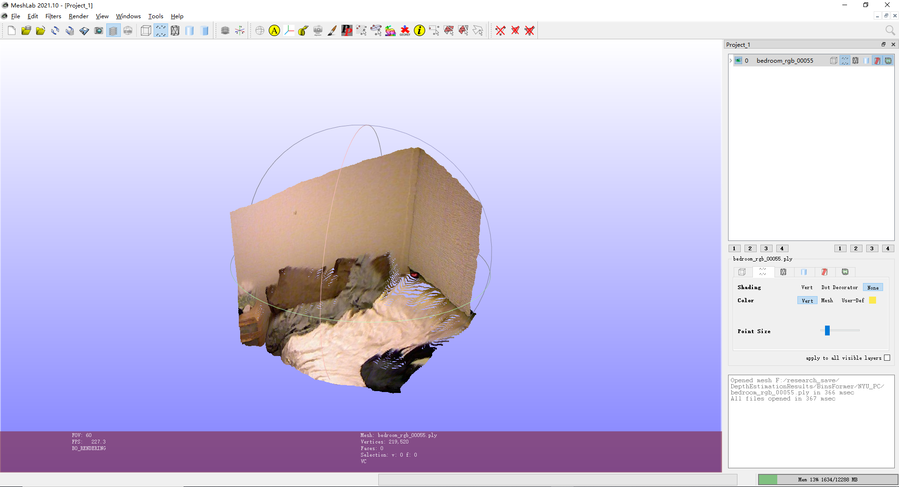
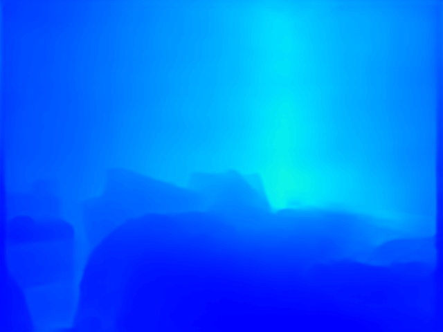
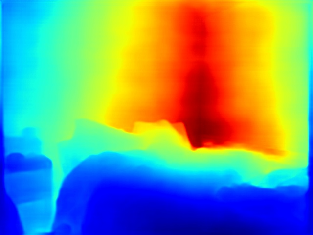
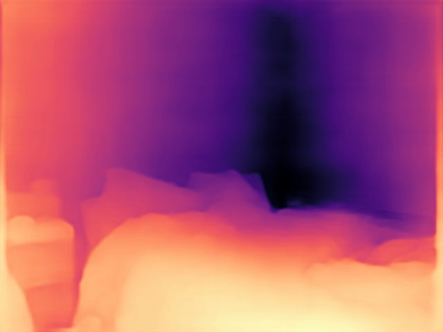

## Inference with pretrained models

We provide testing scripts to evaluate a whole dataset (KITTI, NYU, etc.),
and also some high-level apis for easier integration to other projects.

### Test a dataset

- single GPU
- CPU
- single node multiple GPU
- multiple node

You can use the following commands to test a dataset.

```shell
# single-gpu testing (you may need to set PYTHONPATH)
python tools/test.py ${CONFIG_FILE} ${CHECKPOINT_FILE} [--out ${RESULT_FILE}] [--eval ${EVAL_METRICS}] [--show]

# CPU: disable GPUs and run single-gpu testing script (you may need to set PYTHONPATH)
export CUDA_VISIBLE_DEVICES=-1
python tools/test.py ${CONFIG_FILE} ${CHECKPOINT_FILE} [--out ${RESULT_FILE}] [--eval ${EVAL_METRICS}] [--show]

# multi-gpu testing
./tools/dist_test.sh ${CONFIG_FILE} ${CHECKPOINT_FILE} ${GPU_NUM} [--out ${RESULT_FILE}] [--eval ${EVAL_METRICS}]
```
  
Optional arguments:

- `RESULT_FILE`: Filename of the output results in pickle format. If not specified, the results will not be saved to a file.
- `EVAL_METRICS`: In this version, we only utilize common metrics in depth estimation, such as Abs Rel, RMSE, *etc*. In the feature, we will consider more challengeable 3D metrics. Hence, this arg is in redundancy, where you can pass any character.
- `--show`: If specified, depth results will be plotted on the images and shown in a new window. It is only applicable to single GPU testing and used for debugging and visualization. Please make sure that GUI is available in your environment, otherwise you may encounter the error like `cannot connect to X server`.
- `--show-dir`: If specified, depth results will be plotted on the images and saved to the specified directory. It is only applicable to single GPU testing and used for debugging and visualization. You do NOT need a GUI available in your environment for using this option.
- `--eval-options`: Optional parameters for `dataset.format_results` and `dataset.evaluate` during evaluation. Unuseful right now.

Examples:

Assume that you have already downloaded the checkpoints to the directory `checkpoints/`.

1. Test DepthFormer and visualize the results. Press any key for the next image.

    ```shell
    python tools/test.py configs/depthformer/depthformer_swinl_22k_w7_nyu.py \
        checkpoints/depthformer_swinl_22k_w7_nyu.pth \
        --show
    ```

2. Test DepthFormer and save the painted images for latter visualization.

    ```shell
    python tools/test.py configs/depthformer/depthformer_swinl_22k_w7_nyu.py \
        checkpoints/depthformer_swinl_22k_w7_nyu.pth \
        --show-dir depthformer_swinl_22k_w7_nyu_results
    ```

3. Test DepthFormer on NYU (without saving the test results) and evaluate the mIoU.

    ```shell
    python tools/test.py configs/depthformer/depthformer_swinl_22k_w7_nyu.py \
        checkpoints/depthformer_swinl_22k_w7_nyu.pth \
        --eval x(can be any arg)
    ```

4. Test DepthFormer with 4 GPUs, and evaluate the standard 2D metric.

    ```shell
    bash ./tools/dist_test.sh configs/depthformer/depthformer_swinl_22k_w7_nyu.py \
        checkpoints/depthformer_swinl_22k_w7_nyu.pth \
        4 --eval x(can be any arg)
    ```

5. Ensemble model results for KITTI online benchmark. Take an instance of BTS.

   Run test (only can be done with single GPU) and save formated results in `./bts_r50_kitti_benchmark_24e_temp_1` 

    ``` 
    python configs/bts/bts_r50_kitti_benchmark_24e.py \
        checkpoints/bts_r50_kitti_benchmark_24e.pth \
        --format-only --show-dir bts_r50_kitti_benchmark_24e_temp_1
    ```

   You will get temp files under `./bts_r50_kitti_benchmark_24e_temp_1` directory to be ensembled. You can re-run this script to get multi-model results, 
   which are stored in folders such as `./bts_r50_kitti_benchmark_24e_temp_2`. 

   Then set paths in `tools/ensemble.py` and ensemble multi-model results. You may run `zip -r results.zip your_results_folder/` and submit the zip file to [evaluation server](http://www.cvlibs.net/datasets/kitti/eval_depth.php?benchmark=depth_prediction).

6. For NYU dataset, we provide scripts to visualize reconstructed point clouds.

    Run:

    ```shell
    python ./tools/misc/visualize_point-cloud.py \
        configs/depthformer/depthformer_swinl_22k_w7_nyu.py \
        checkpoints/depthformer_swinl_22k_w7_nyu.pth \
        --output-dir point-cloud
    ```
   
   You can find `.xyz` files in `./point-cloud`. Then just use visualization tools, such as MeshLab, to see reconstructed point clouds.

   Here is an example:
   <div align=center>

### Tips about visualization

In most papers, visualized depth maps are rendered with a specific colormap. These kinds of rendering are not invertible, leading to a difficulty to make qualitative comparisons among various methods. While it is hard to align the results of previous work, we implement a unified and also parameterizable rendering interface (I will add args in test.py in the next version).

In this hack version, please refer to file `depth/utils/color_depth.py`. The parameters indicate several possible rendering manners. Comparisons can be seen below.

```
python ./tools/test.py configs/bts/bts_r50_nyu_24e.py nfs/saves/bts/bts_r50_nyu/epoch_24.pth --show-dir nfs/saves/visualization
```

| `cmap`\\`vmin,vmax` | Given Real Numbers | None|
| :------:            | :--------: |  :--------: | 
| `jet`               | <div align=center></div> | <div align=center></div>
| `magma_r`           | <div align=center></div> | <div align=center></div>

